# Chapter 4: Project Implementation

## 4.1 User Interface Design

User interface (UI) design is a critical component of the QuantumZero system, as it defines how users interact with sensitive identity data, cryptographic processes, and trust-based workflows. Effective UI design ensures that complex operations—such as credential issuance, selective disclosure, and verification—are presented to users in a clear, intuitive, and secure manner. The goal of the QuantumZero UI is to enable users to complete required tasks efficiently while minimizing cognitive load and shielding them from underlying technical complexity.

The QuantumZero user interface design is informed by an analysis of users, tasks, and operating environments. Two primary user groups are supported: end users operating the mobile wallet application and administrators interacting with the system through a web-based administrative interface. Each group has distinct goals, permissions, and levels of technical expertise, which are reflected in the structure and behavior of the interfaces. The UI design adheres to established usability heuristics, including consistency, reversibility of actions, visibility of system state, and error prevention.

### 4.1.1 Interface Types

The QuantumZero system incorporates multiple interface types to support user interaction and system interoperability. These interfaces are categorized as user interfaces, external interfaces, and internal interfaces.

#### User Interfaces

- **Mobile Wallet Interface:** The primary interface for end users. It supports credential storage, credential presentation, selective disclosure, offline QR-based verification, and wallet backup and recovery operations.
- **Administrative Web Interface:** A browser-based interface for authorized administrators. It enables issuer management, credential schema administration, revocation management, audit log review, and system health monitoring.

#### External Interfaces

- **Verifier Interaction Interface:** Allows third-party verifiers to request and validate verifiable presentations through QR-based or online mechanisms without accessing raw credentials.
- **Backend Service Interfaces:** Logical interfaces used by the wallet and administrative UI to communicate with backend services responsible for issuance, verification, and trust registry lookups.

#### Internal Interfaces

- **Wallet UI to Wallet Logic Interface:** Connects user-driven actions to local cryptographic operations and secure storage within the wallet.
- **Administrative UI to Backend Services Interface:** Translates administrative actions into backend configuration and management operations.

### 4.1.2 User Tasks and Interaction Scenarios

User tasks define the functional goals that drive interface behavior. The QuantumZero UI is organized around task-based workflows rather than technical processes.

#### End User Tasks (Mobile Wallet)

1. Create and manage a decentralized identifier (DID)
2. View, organize, and manage stored verifiable credentials
3. Present credentials to verifiers in online or offline contexts
4. Selectively disclose specific credential attributes
5. Restore wallet data using an encrypted backup

Each task is designed to minimize the number of required actions and to provide clear feedback regarding task progress and completion.

#### Administrator Tasks (Web Interface)

1. Register and manage trusted credential issuers
2. Define and maintain credential schemas
3. Revoke issued credentials
4. Review issuance and verification audit logs
5. Monitor system health and operational status

Administrative workflows emphasize clarity, traceability, and safeguards against accidental or unauthorized actions.

### 4.1.3 Window Navigation Diagram

Window navigation diagrams illustrate how users transition between screens and functional areas within the QuantumZero interfaces. Separate navigation models are defined for end users and administrators to reflect their differing roles, permissions, and workflows.

#### 4.1.3.1 Window Navigation Diagram Outline (Nodes and Transitions)

This outline defines the screens (nodes) and the allowed navigation paths (transitions) for each QuantumZero interface. The navigation is designed around task-based workflows (credential management, presentation, verification, and recovery) while maintaining role separation between end users and administrators.

##### 4.1.3.1.1 Mobile Wallet Navigation

**Nodes (Screens):**

1. Launch / Welcome Screen
2. Wallet Home Dashboard
3. Credential List View
4. Credential Detail View
5. Present Credential Screen
6. Selective Disclosure Screen
7. QR Presentation Screen
8. Verification Result Screen
9. Wallet Settings
10. Backup and Recovery Screen

**Transitions:**

* **Launch → Wallet Home Dashboard**  
  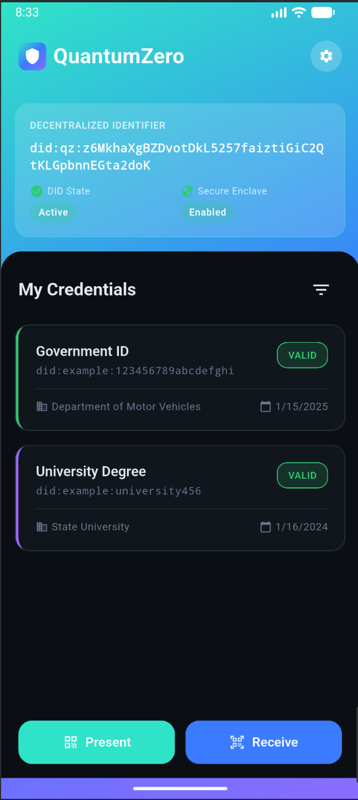  
  _The main dashboard provides quick access to credentials, settings, and key wallet functions. Users can view credential count and access primary navigation options._

* **Wallet Home → Credential List View**  
  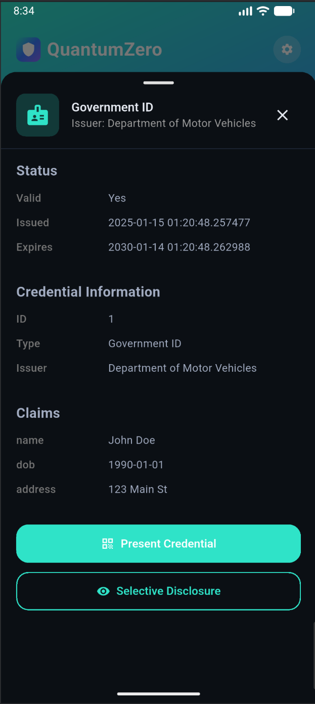  
  _Displays all stored verifiable credentials with summary information. Users can browse, search, and select credentials for detailed viewing or presentation._

* **Credential List → Credential Detail View**  
    
  _Shows complete credential information including issuer, issuance date, expiration, and all claims. Users can verify credential status and initiate presentation._

* **Credential Detail → Present Credential Screen**  
  _Initiates the credential presentation workflow, allowing users to choose how to share their credential information._

* **Present Credential → Selective Disclosure Screen**  
  _Enables users to select which specific attributes to disclose to the verifier, supporting privacy-preserving credential sharing._

* **Selective Disclosure → QR Presentation Screen**  
  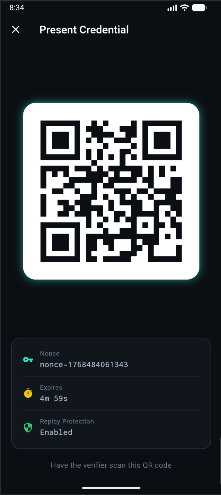  
  _Generates and displays a QR code containing the verifiable presentation for offline verification. The QR code encodes selected attributes and cryptographic proof._

* **QR Presentation → Verification Result Screen**  
  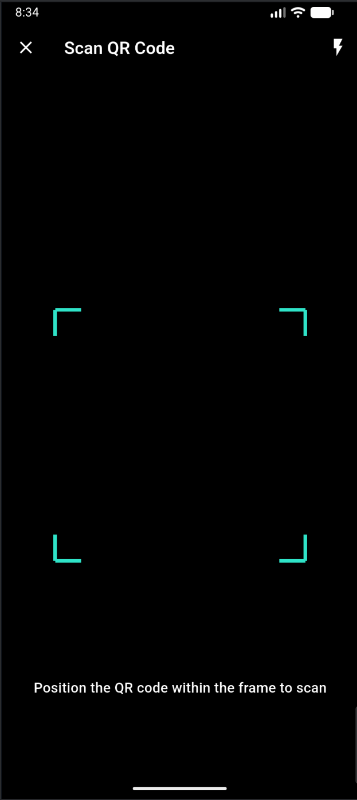  
  _Shows the outcome of credential verification, indicating whether access was granted or denied based on the presented credentials._

* **Wallet Home → Wallet Settings**  
  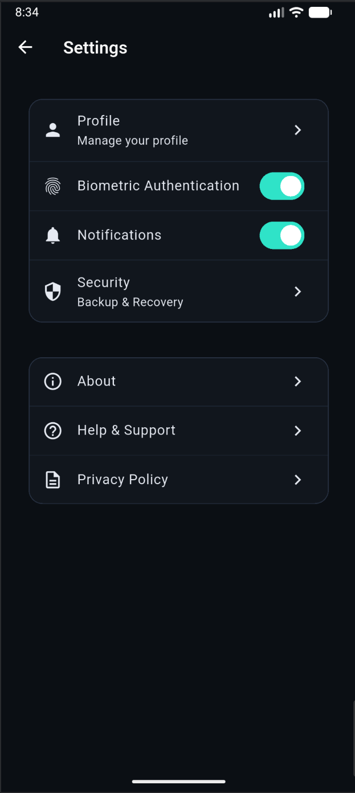  
  _Provides access to wallet configuration options, including backup/recovery, security settings, and application preferences._

* **Wallet Settings → Backup and Recovery Screen**  
  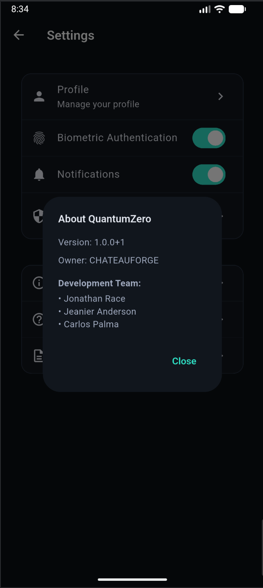  
  _Manages encrypted wallet backups and restoration procedures. Users can create new backups or restore from existing encrypted backup files._

**Diagram:** See [interface-mobile.mmd](diagrams/interface-mobile.mmd)

##### 4.1.3.1.2 Administrative Web Interface Navigation

**Nodes (Screens):**

1. Administrator Login
2. Admin Dashboard
3. Issuer Management
4. Credential Schema Management
5. Revocation Management
6. Audit Log Viewer
7. System Health Monitor

**Transitions:**

* **Administrator Login → Admin Dashboard**  
  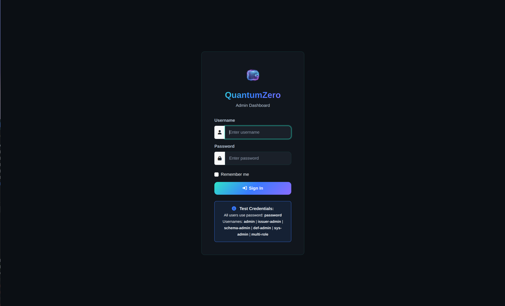  
  _Secure authentication portal for system administrators. Requires valid credentials and may include multi-factor authentication for enhanced security._
  
  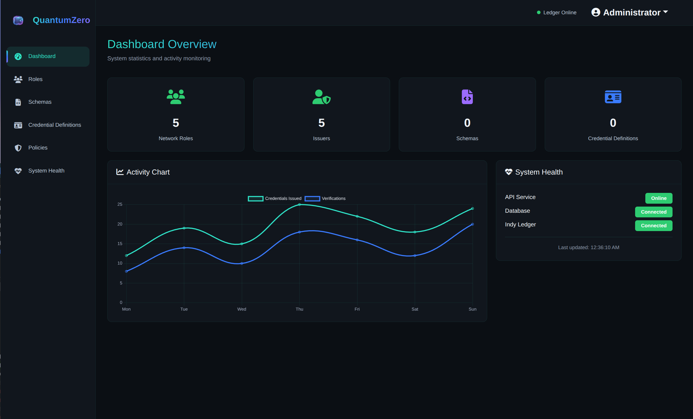  
  _Central administrative control panel providing overview of system status, recent activities, and quick access to all management functions._

* **Admin Dashboard → Issuer Management**  
  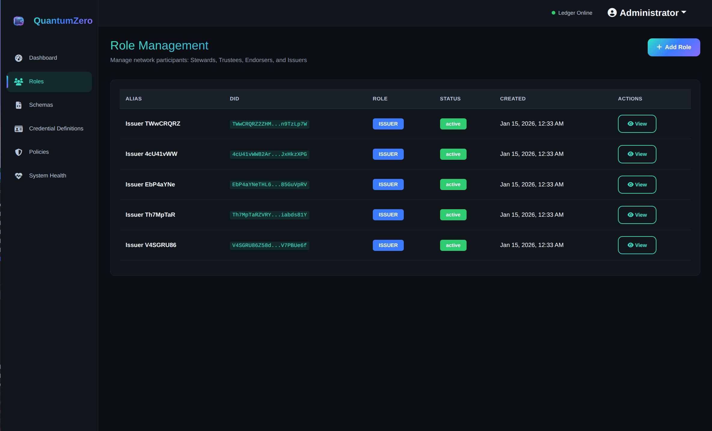  
  _Manages trusted credential issuers including registration, approval/revocation of issuer status, and DID/key management. Supports role-based access control._

* **Admin Dashboard → Credential Schema Management**  
  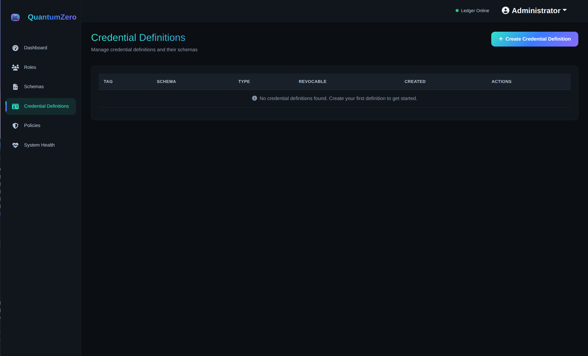  
  _Defines and maintains credential schema structures, specifying required attributes, data types, and validation rules._
  
  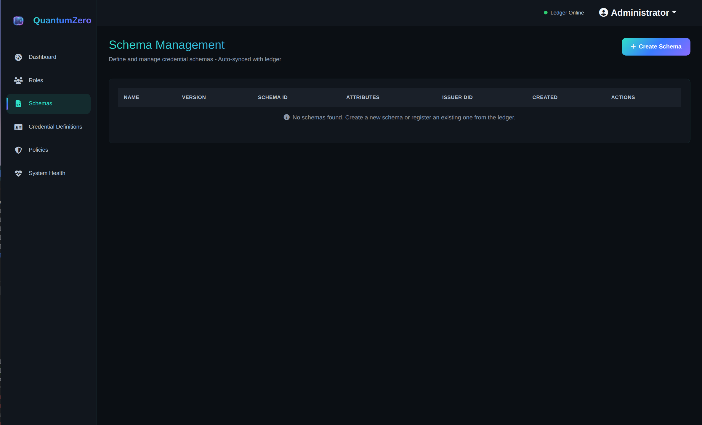  
  _Lists all registered credential schemas with version information. Allows creation, editing, and publication of schema definitions to the trust registry._

* **Admin Dashboard → Revocation Management**  
  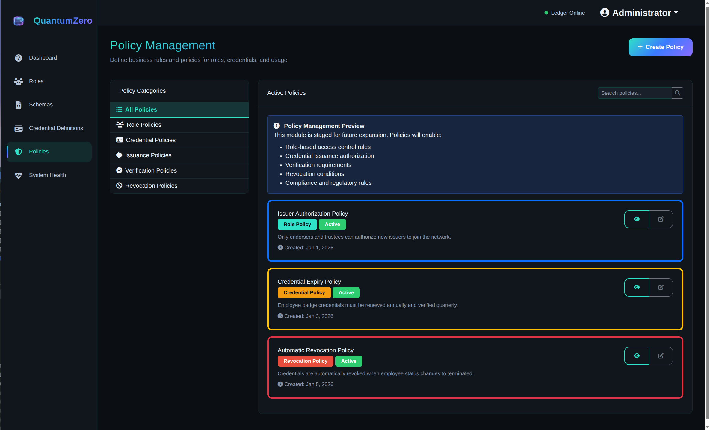  
  _Manages credential revocation policies and processes. Administrators can search for issued credentials and initiate revocation with proper authorization and audit trail._

* **Admin Dashboard → Audit Log Viewer**  
  _Provides comprehensive view of system events including issuance, verification, revocation, and administrative actions. Supports filtering, search, and export capabilities._

* **Admin Dashboard → System Health Monitor**  
  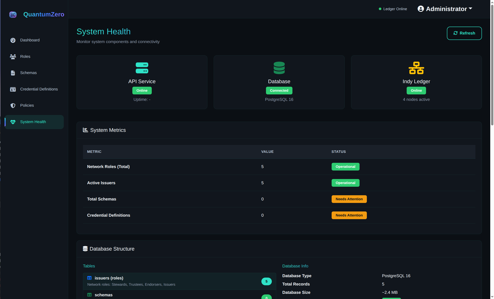  
  _Displays real-time system health metrics including service status, API response times, error rates, and ledger synchronization status._

* **Any Administrative Screen → Admin Dashboard**  
  _All administrative screens provide navigation back to the central dashboard, ensuring administrators can quickly access any management function._

**Diagrams:** See [interface-server-1.mmd](diagrams/interface-server-1.mmd) and [interface-server-2.mmd](diagrams/interface-server-2.mmd)

### 4.1.4 Interface States and User Feedback

The QuantumZero user interfaces are designed to clearly communicate system state and outcomes to users. Common interface states include:

- **Idle:** Default state awaiting user input
- **Loading:** Operation in progress
- **Success:** Operation completed successfully
- **Warning:** Potential issue requiring attention
- **Error:** Operation failed or critical issue detected

Visual indicators such as icons, color cues, and progress indicators provide immediate feedback during operations such as credential presentation or verification.

To reduce memory load, the interface presents only task-relevant information at each stage and uses progressive disclosure to reveal advanced options when appropriate. Credential status indicators—such as valid, expired, or revoked—are displayed consistently across the interface to support rapid interpretation by users.
